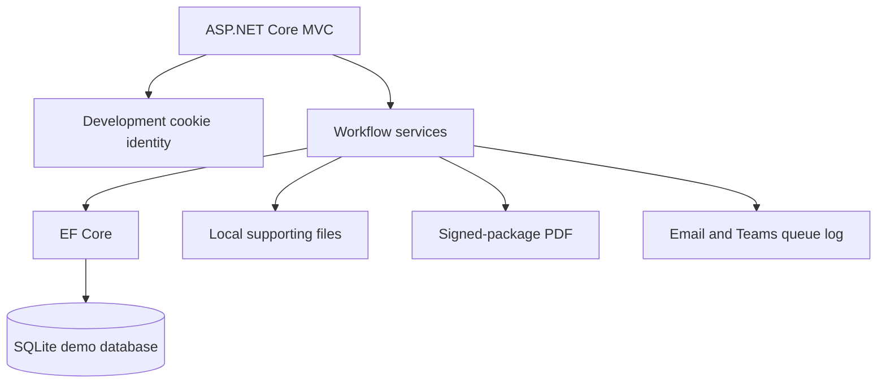
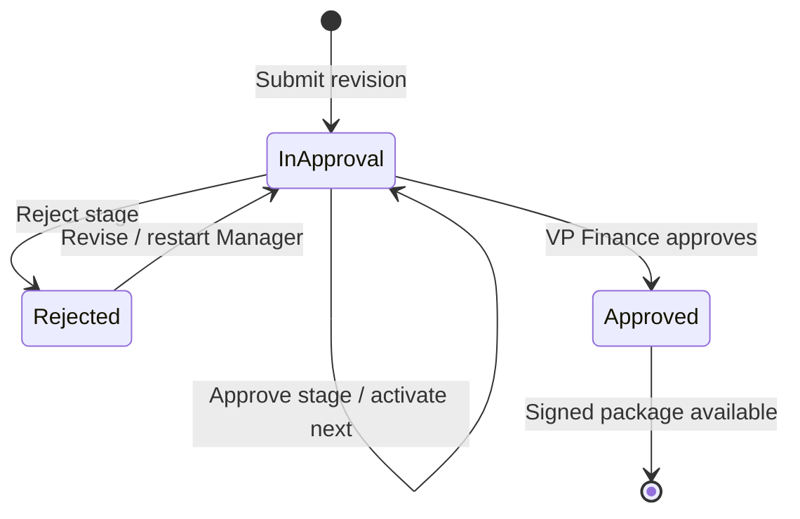

# Architecture

## Demonstration topology

The application is a conventional server-rendered web app. This keeps the first demonstration inexpensive, debuggable, and easy to host in Azure App Service. Domain, workflow, file storage, notification, and current-user concerns are separated behind services so that production integrations can replace demo implementations.

## Core data ownership

| Aggregate | Purpose |
|---|---|
| `ApprovalRequest` | Current request state and confirmed manager |
| `RequestRevision` | Immutable revision history and restart evidence |
| `RequestAttachment` | Original file metadata by revision |
| `ApprovalRouteVersion` | Immutable published configuration selected at submission |
| `ApprovalRouteStage` / `RouteRule` | Ordered stages, named approvers, and conditional logic |
| `ApprovalInstance` / `ApprovalDecision` | Per-request stage execution and signature evidence |
| `AuditEvent` | Security-meaningful workflow and configuration events |
| `NotificationLog` | Demonstration queue for Email and Teams delivery |

## Pilot state transitions

## Production substitutions

| Demonstration component | Production component |
|---|---|
| Development cookie identity selector | Microsoft Entra ID OpenID Connect |
| Seeded manager relationship | Microsoft Graph manager lookup plus requester confirmation |
| SQLite | Azure SQL Database using managed identity |
| Local file system | Azure Blob Storage or SharePoint with scanning and retention |
| Notification log | Graph/Teams delivery worker with retries |
| In-process PDF generation | Hardened package service with archival validation |
| `EnsureCreated` | Reviewed, automated EF Core migrations |

## Future agent boundary

A Copilot Studio agent should call a constrained application API rather than connect directly to tables. Suitable actions include starting a draft, explaining required fields, retrieving status, summarizing a request for an assigned approver, and answering policy questions from approved sources.

The agent must not approve, reject, adopt a signature, publish a route, change an approver, or bypass record-level authorization. Every agent action should carry the user identity, enforce the same application authorization, and create an audit event.

