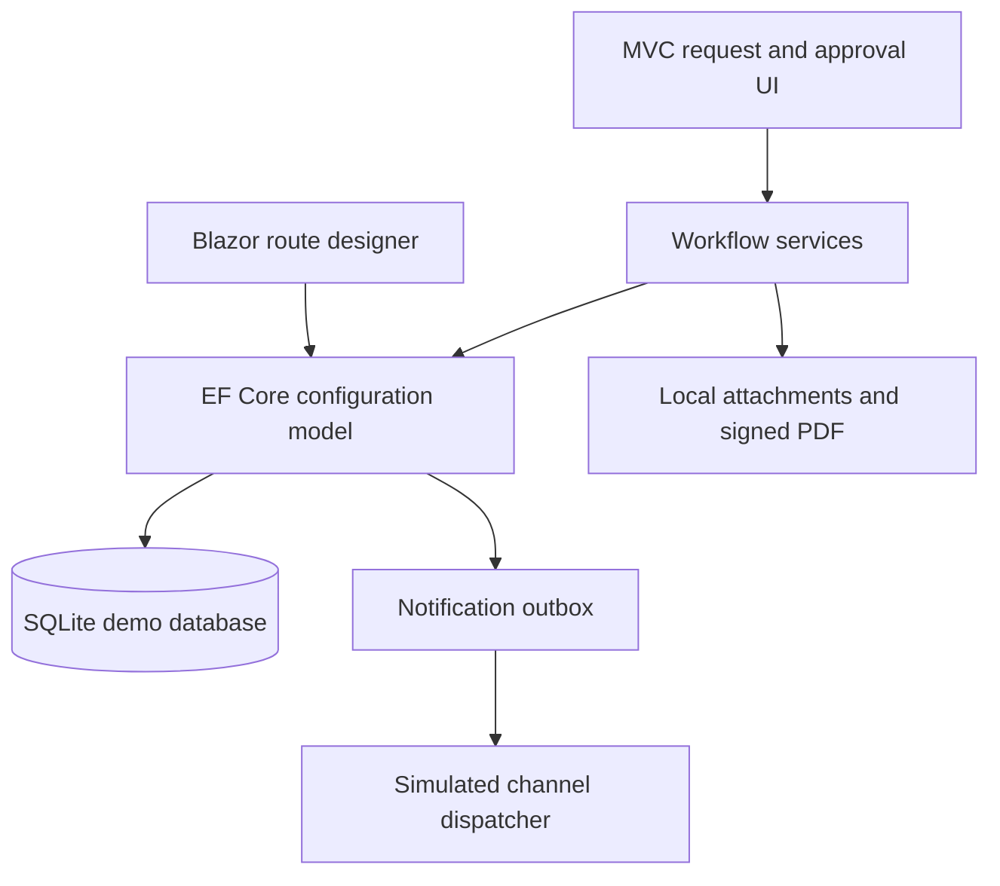
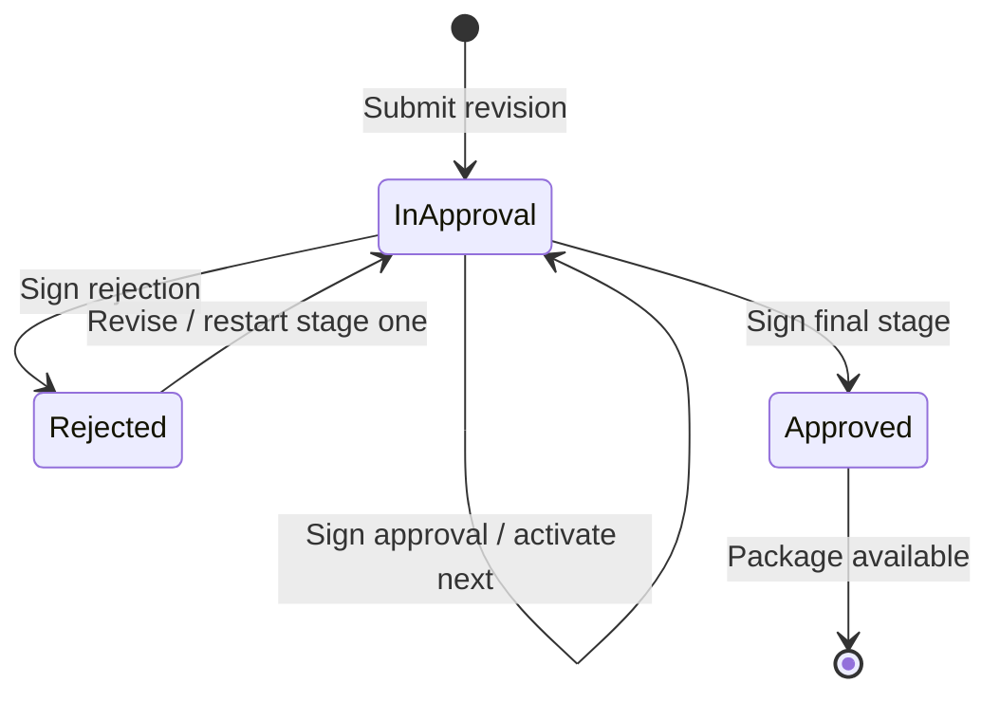
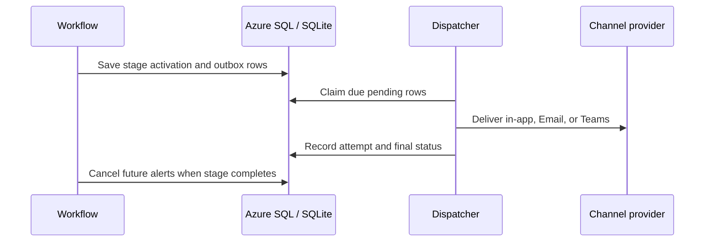

# Architecture

## Demonstration topology

The single .NET 10 application deliberately uses two UI modes: conventional MVC for stable form posts, files, and approval decisions; interactive server-side Blazor for the administrator’s configuration workspace. Both paths use the same domain model and authorization boundary. In production, Azure App Service and Azure SQL can host this shape before additional messaging infrastructure is justified.

## Configuration-to-runtime model

| Aggregate | Purpose |
|---|---|
| `DocumentType` / `DocumentFieldDefinition` | Defines each intake form and routable field keys |
| `ApprovalRouteVersion` | Immutable published configuration selected at submission |
| `ApprovalRouteStage` / `RouteRule` | Ordered stages, assignment strategy, signature requirement, and AND conditions |
| `AlertPolicy` | Versioned assignment, reminder, escalation, and outcome channels/delays |
| `ApprovalRequest` / `RequestFieldValue` | Request state plus revision-specific snapshots of dynamic field values |
| `RequestRevision` / `RequestAttachment` | Restart history and original file metadata by revision |
| `ApprovalInstance` / `ApprovalDecision` | Per-request stage execution and authenticated signature evidence |
| `NotificationOutbox` / `NotificationDeliveryAttempt` | Idempotent scheduled delivery, retry, cancellation, and channel evidence |
| `AuditEvent` | Security-meaningful workflow and configuration events |

The runtime never looks for a stage named President or Finance. It selects the published route by `DocumentTypeId`, evaluates rules by stable field key, and resolves each stage using one of three strategies: requester manager, named user, or user selected in a configured person field.

## Workflow state

## Alert lifecycle

In the prototype, delivery is simulated and every due record succeeds. The important boundary is already present: workflow state and alert intent are stored together, channels use idempotency keys, future alerts can be cancelled, and delivery attempts are inspectable. A production dispatcher can replace simulation without changing route evaluation or approval decisions.

## Demonstration-to-production substitutions

| Demonstration component | Production component |
|---|---|
| Development cookie identity selector | Microsoft Entra ID OpenID Connect |
| Seeded manager relationship | Microsoft Graph manager lookup plus requester confirmation |
| SQLite and `EnsureCreated` | Azure SQL, managed identity, and reviewed EF Core migrations |
| Local file system | Blob Storage or SharePoint with scanning, retention, and legal hold |
| In-process simulated dispatcher | App Service WebJob initially; Graph Email/Teams adapters with retry/dead-letter controls |
| In-process PDF generation | Hardened package/archive service with integrity validation |
| Application logs | Application Insights, operational alerting, and immutable audit export |

Azure Service Bus and Functions are optional later boundaries for higher volume, isolation, or independent scaling; they are not required to validate the first workflows.

## Copilot Studio boundary

A Copilot Studio agent should call protected application APIs rather than connect directly to tables. Suitable actions include explaining fields, starting a draft, identifying missing information, retrieving status, and summarizing evidence for an assigned approver.

The agent must not approve, reject, adopt a signature, publish a route, alter an approver, or bypass record-level authorization. Every call must carry the user identity, enforce the same application permissions, resist prompt-injection attempts from attached documents, and create an audit event.
