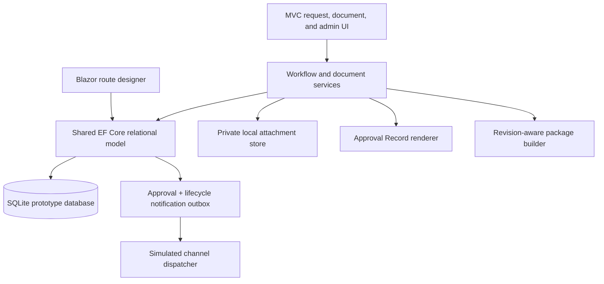
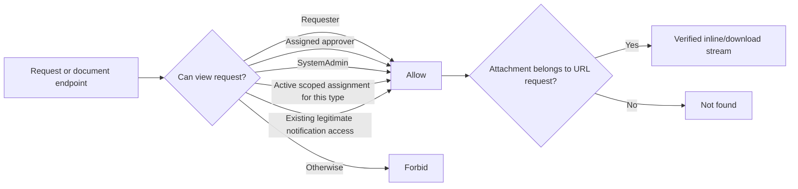
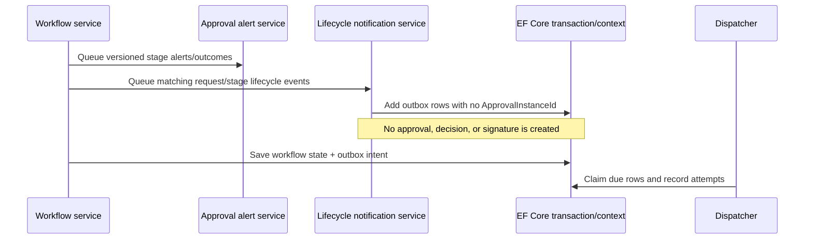
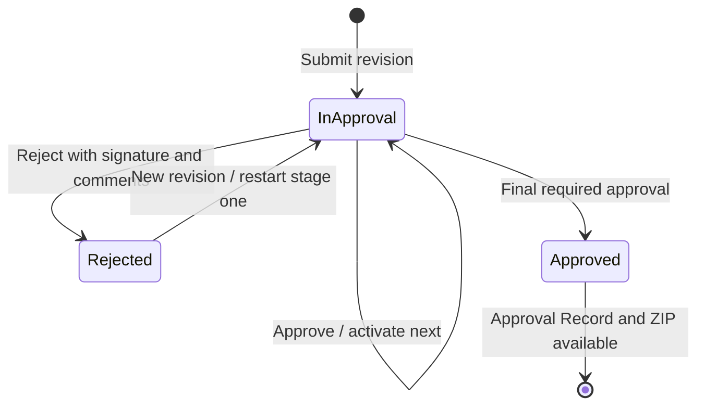

# Architecture

## Demonstration topology

The single .NET 10 host deliberately uses conventional MVC for stable form posts, file streaming, approvals, and administration, with interactive server-side Blazor for the workflow designer. Both paths use the same EF Core model. Configuration is relational rather than stored in JSON blobs, preserving the SQL Server/Azure SQL path.

## Configuration-to-runtime model

| Aggregate | Purpose |
|---|---|
| `DocumentType` / `DocumentFieldDefinition` | Defines the intake form, stable field keys, request-number prefix, and availability |
| `DocumentTypeAccess` | Assigns Administrator, Coordinator, or Viewer to one Document Type without changing global application roles |
| `LifecycleNotificationRule` | Defines non-approval event, optional stable stage key, recipient resolution, delay, enabled state, and channels |
| `ApprovalRouteVersion` | Immutable published configuration selected at submission; editable drafts remain isolated |
| `ApprovalRouteStage` / `RouteRule` | Ordered approval stages, stable cross-version stage key, assignee strategy, signature requirement, and AND conditions |
| `AlertPolicy` | Versioned approval-stage assignment, reminder, escalation, and outcome behavior |
| `ApprovalRequest` / `RequestFieldValue` | Request state plus revision-specific snapshots of dynamic values |
| `RequestRevision` / `RequestAttachment` | Restart history and original attachment metadata by revision |
| `ApprovalInstance` / `ApprovalDecision` | Per-request stage execution and authenticated adopted-signature evidence |
| `NotificationOutbox` / `NotificationDeliveryAttempt` | Idempotent scheduled delivery, retry/cancellation state, and channel evidence for both notification families |
| `AuditEvent` | Security-meaningful workflow and configuration events |

The runtime never looks for a stage named President, Finance, or Purchasing. It selects the published route by `DocumentTypeId`, evaluates rules by stable field key, and resolves assignees through requester manager, named user, or a configured person field.

## Authorization boundary

`DocumentAuthorizationService` is the common decision point for request visibility and Document Type oversight.

Administrators, Coordinators, and Viewers currently share the scoped operational read permission. Configuration and route publication remain protected by the global `SystemAdmin` authorization policy. A scoped assignment never grants approval authority.

## Workflow and lifecycle notifications

The two notification concepts intentionally share delivery infrastructure but not approval semantics. Lifecycle idempotency keys include rule, request, revision, stage key, recipient, channel, and event. Stage-specific rules use `ApprovalRouteStage.StageKey`, retained when a route version is cloned.

## Request state

Lifecycle notifications observe these transitions. They never drive them.

## Document pipeline

Uploads are stored under generated basenames after extension allow-list, size, and magic-byte/container-header checks. `LocalFileStorageService` rejects path segments when opening a stored file. `IFilePreviewService` re-inspects content before selecting an inline or download content type.

- PDF, PNG, JPEG, and text can stream inline with private/no-store, nosniff, same-origin framing, and restrictive CSP headers.
- Office files are download-only. No private document is submitted to a public viewer.
- Every preview/download first passes request authorization and then an exact request/attachment pair lookup.

After approval, `ApprovalRecordService` maps current request values, route/stage evidence, history, and the attachment index into a MigraDoc document rendered by PDFsharp. `DocumentPackageService` adds that PDF and all original revisioned attachments to a ZIP, computes SHA-256 over the packaged bytes, and writes a manifest without internal paths.

## Prototype persistence

The app still calls `EnsureCreated`. The default database moved to `document-approval-v3-demo.db` so an existing v2 prototype is preserved rather than destructively upgraded. This is a prototype-only schema strategy; production requires reviewed migrations, backup/restore, rollback, and concurrency policies.

## Demonstration-to-production substitutions

| Demonstration component | Production component |
|---|---|
| Development cookie identity selector | Microsoft Entra ID OpenID Connect |
| Seeded manager relationship | Microsoft Graph manager lookup plus requester confirmation |
| SQLite and `EnsureCreated` | Azure SQL, managed identity, reviewed EF Core migrations |
| Local private file system | Blob Storage or SharePoint with malware scanning, retention, encryption, and legal hold |
| In-process simulated dispatcher | Durable worker/WebJob and approved Graph Email/Teams adapters with dead-letter controls |
| On-demand local PDF/ZIP generation | Capacity-tested renderer/archive pipeline, approved fonts, optional persisted immutable package |
| Application-local audit data | Application Insights plus immutable audit export/SIEM integration |

Azure Service Bus and Functions are optional later boundaries for higher volume, isolation, or independent scaling; they are not required to validate the workflows.

## Copilot Studio boundary

A Copilot Studio agent should call protected application APIs rather than connect directly to tables. Suitable actions include explaining fields, starting a draft, identifying missing information, retrieving status, and summarizing evidence for an assigned approver.

The agent must not approve, reject, adopt a signature, publish a route, alter an approver, retrieve an unauthorized file, or bypass record-level authorization. Every call must carry the user identity, apply the same authorization service, resist prompt injection from attachments, and create an audit event.
